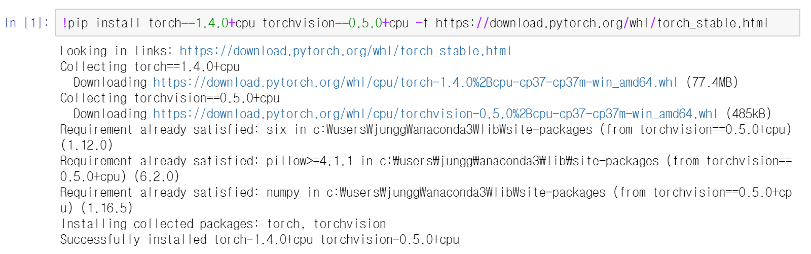

## 2. 파이토치 시작하기


### 2.1 파이토치 설치 & 환경구성

#### 2.1.1 Anaconda 설치

Anaconda는 과학 연구 및 머신러닝 분야에 적합한 Python 및 R 언어의 패키지 / 의존성 관리 및 배포를 편리하게 해주는 무료 오픈 소스 SW 이름이다. 

https://www.anaconda.com/


#### 2.1.2 파이토치 설치

https://pytorch.org/ 에 접속하여 아래쪽으로 내려오면 다음과 같은 화면을 볼 수 있다.


여러가지 옵션이 있는데 사용자에게 필요한 옵션을 체크해 주면 아래쪽에 **Run this command**에 나오는 설치 명령어를 복사해서 실행하면 된다. 옵션을 살펴보면 OS, Package, Laungae, CUDA(GPU 관련)이 존재한다.

Jupyter Notebook에서 다음과 같이 실행하면 설치가 되는 것을 확인할 수 있다.



그리고 자연어 처리 도구인 토치 텍스트를 설치해 보자. 방법은 유사하다.

```python
pip install torchtext
```


