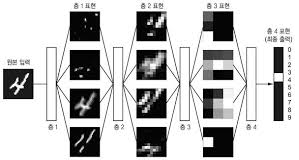
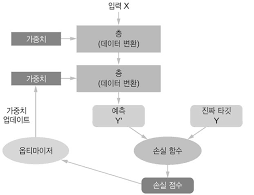

# 1장. 딥러닝이란 무엇인가?

### 1.1 인공 지능과 머신 러닝, 딥 러닝

#### 1.1.1 인공 지능

인공 지능은 1950년대 초기 컴퓨터 과학 분야의 일부 선각자들이 "컴퓨터가 '생각'할 수 있는가?"라는 질문을 하면서 시작되었다. 이 분야에 대한 간결한 정의는 다음과 같다. **보통의 사람이 수행하는 지능적인 작업을 자동화하기 위한 연구 활동**이다. AI(Artificial Intelligence)는 머신 러닝과 딥러닝을 포괄하는 분야이다. 또 학습 과정이 전혀 없는 다른 방법도 많이 포함하고 있다. 

아주 오랜기간 동안 많은 전문가는 프로그래머들이 명시적인 규칙을 충분하게 많이 만들어 지식을 다루면 인간 수준의 인공지능을 만들 수 있다고 생각했다. 인공지능 초기에는 이런 **심볼릭 AI(symbolic AI)**라는 방법으로 접근했다. 심볼릭 AI가 체스 게임처럼 잘 정의된 문제를 해결하는 데 적합하다고 증명되었지만, 더 복잡하고 불분명한 문제를 해결하기 위한 명확한 규칙을 찾는 것은 매우 어렵기 때문에 이런 심볼릭 AI를 대체하기 위한 새로운 방법이 등장했는데 이를 **머신 러닝**이라고 한다.

#### 1.1.2 머신 러닝

머신 러닝은 "우리가 어떤 것을 작동시키기 위해 '어떻게 명령할 지 알고 있는 것'이상을 컴퓨터가 처리하는 것이 가능한가? 그리고 특정 작업을 수행하는 법을 스스로 학습할 수 있는가? 프로그래머가 직접 만든 데이터 처리 규칙 대신 컴퓨터가 데이터를 보고 자동으로 규칙을 학습할 수 있을까?" 이런 질문에서 시작된다.

이 질문은 새로운 프로그래밍 패러다임의 장을 열었다. 전통적인 프로그래밍인 <u>**심볼릭 AI**</u>의 패러다임에서는 규칙과 규칙에 따라 처리될 데이터를 입력하면 해답이 출력된다. <u>**머신 러닝**</u>에서는 데이터와 이 데이터로부터 기대되는 해답을 입력하면 규칙이 출력된다. 이 규칙을 새로운 데이터에 적용하여 예측할 수 있다.

머신 러닝 시스템은 명시적으로 프로그램 되는 것이 아니라 훈련시키는 것이다. 작업과 관련 있는 많은 샘플을 제공하면 데이터에서 구조를 찾아 그 작업을 자동화하기 위한 규칙을 만들어 낸다.

#### 1.1.3 데이터에서 표현을 학습하기

머신 러닝은 샘플과 기댓값이 주어졌을 때 데이터 처리 작업을 위한 실행 규칙을 찾는 것이다. 머신 러닝을 하기 위해서는 <u>세 가지</u>가 필요하다.

1. **입력 데이터**: 예를 들어 주어진 문제가 음석 인식이라면, 입력 데이터는 사람의 목소리가 녹음된 파일이다. 만약 이미지 태깅에 관한 문제라면 입력 데이터는 이미지(사진)가 된다.
2. **기대 출력**: 음성 인식 작업에서는 사람이 사운드 파일을 듣고 옮긴 글이다. 이미지 작업에서 기대하는 결과는 '강아지', '고양이' 등과 같은 태그이다.
3. **알고리즘의 성능을 측정하는 방법**: 알고리즘의 현재 출력과 기대 출력 간의 차이를 결정하기 위해 필요하다. 측정값은 알고리즘의 작동 방식을 교정하기 위한 신호로 다시 피드백된다. 이런 수정 단계를 **학습(learning)**이라고 한다.

머신 러닝 모델은 입력 데이터를 의미 있는 결과를 반환한다. 이것이 알고 있는 입력과 출력의 샘플로부터 학습하는 과정이다. 그렇게 때문에 머신 러닝과 딥러닝의 핵심 문제는 **의미 있는 데이터로의 변환**이다. 다시 말하면 입력 데이터를 기반으로 기대 출력에 가깝게 만드는 유용한 표현을 **학습**하는 것이다.

표현이란 데이터를 인코딩하거나 묘사하기 위해 데이터를 바라보는 다른 방법이다. 예를 들면, 컬러 이미지는 RGB포맷이나 HSV 포맷으로 인코딩 될 수 있다. 이들은 같은 데이터의 **두 가지 다른 표현**이다. 어떤 표현으로는 해결하기 힘든 문제가 다른 표현으로는 쉽게 해결될 수 있다. 예를 들어 '이미지에 있는 모든 빨간색 픽셀을 선택'하는 문제는 RGB포맷에서는 쉽지만 '이미지의 채도를 낮추는' 것은 HSV 포맷이 더 수월하다. 머신 러닝 모델은 입력 데이터에서 적절한 표현을 찾는 것이다. 이런 데이터 변환은 분류 작업 같은 문제를 더 쉽게 해결할 수 있도록 해 준다.

 흰색 포인트와 빨간색 포인트를 완벽하게 구분하는 새로운 데이터 표현이다.

좌표 변환을 통해 새로운 표현을 만들었다. 이 좌표 변환을 통해 'x>0 이면 빨간색 포인트이다.' 또는 'x<0 이면 흰색 포인트다.'라는 간단한 규칙으로 나타낼 수 있다.

이 경우에는 직접 좌표 변환을 정했다. 만약 시스템적으로 가능한 여러 좌표 변환을 찾아서 포인트 중 몇 퍼센트가 정확리 분류되었는지를 **피드백**으로 사용한다면, 바로 머신 러닝을 적용하고 있다. 이처럼 머신 러닝에서 **학습**이란 더 나은 표현을 찾는 자동화된 과정이다.

#### 1.1.4 딥러닝에서 '딥'이란?

딥러닝은 머신 러닝의 특정한 분야로서 연속된 **층**에서 점진적으로 의미 있는 표현을 배우는 데 강점이 있으며, 데이터로부터 표현을 학습하는 새로운 방식이다. 그냥 연속된 층으로 표현을 학습한다는 개념을 나타낸다. 데이터로부터 모델을 만드는 데 얼마나 많은 층을 사용했는지가 모델의 **깊이**가 된다. 이 층들을 모두 훈련 데이터에 노출해서 자동으로 학습시킨다. 한편 다른 머신 러닝 접근 방법은 1~개의 데이터 표현 층을 학습하는 경향이 있다. 그래서 이런 방식을 **얕은 학습**이라고 한다.

딥러닝에서는 기본 층을 겹겹이 쌓아 올려 구성한 **신경망(Neural Network)**이라는 모델을 사용하여 표현 층을 학습한다. 딥러닝은 그냥 데이터로부터 표현을 학습하는 수학 모델이다.

심층 신경망을 정보가 연속된 필터를 통과하면서 순도 높게 정제되는 다단계 정보 추출 작업이다. 딥러닝은 이와 같이 데이터 표현을 학습하기 위한 다단계 처리 방식을 말한다.

#### 1.1.5 그림 3개로 딥러닝의 작동 원리 이해하기

머신 러닝이 많은 입력과 타겟(target)의 샘플을 관찰하면서 입력을 타겟에 매핑하는 것임을 알았다. 심층 신경망은 이런 입력-타겟 매핑을 간단한 데이터 변환기(층)를 많이 연결하여 수행하는 것이다. 이런 데이터 변환은 샘플에 노출됨으로써 학습이 이루어진다.

층에서 입력 데이터가 처리되는 상세 내용은 일련의 숫자로 이루어진 층의 **가중치(weight)**에 저장되어 있다. 기술적으로 말하면 층에서 일어나는 변환은 그 층의 가중치를 **파라미터**로 가지는 함수로 표현된다. **학습**은 주어진 입력을 정확한 타겟에 매핑하기 위해 신경망의 모든 층에 있는 가중치 값을 찾는 것이다. 하지만 어떤 심층 신경망은 수천만 개의 파라미터를 가지기도 한다. 이런 경우에 모든 파라미터의 정확한 값을 찾는 것은 어렵다. 파라미터 하나의 값을 바꾸면 다른 모든 파라미터에 영향을 끼치기 때문이다. 

어떤 것을 조정하려면 관찰해야 한다. 신경망의 출력을 제어하려면 출력이 기대하는 것보다 얼마나 벗어났는지는 신경망의 **손실 함수(loss function** 또는 **목적 함수(objective function)**를 측정하면 된다. 기본적인 딥러닝 방식은 이 점수를 피드백 신호로 사용하여 현재 샘플의 손실 점수가 감소되는 방향으로 가중치 값을 조금씩 수정한다. 이런 수정 과정은 딥러닝의 핵심 알고리즘인 **역전파(backpropagation)** 알고리즘을 구현한 **옵티마이저(optimizer)**가 담당한다.

초기에는 네트워크의 가중치가 랜덤한 값으로 할당하여 랜덤한 변환을 연속적으로 수행한다. 출력은 기대한 것과 멀어지고 손실이 커지지만 네트워크가 모든 샘플을 처리하면서 가중치가 올바른 방향으로 조정되고 손실 값이 감소한다. 이를 **훈련 반복(training loop)**이라고 하며, 충분한 횟수만큼 반복하면 손실 함수를 최소화하는 가중치 값을 산출한다.

#### 1.1.6 지금까지 딥러닝의 성과

딥러닝은 머신 러닝의 오래된 하위 분야이지만 2010년 초가 되어서 유명해졌다. 사람에게는 자연스럽고 직관적으로 보이지만 기계로는 오랫동안 해결하기 어려웠던 시각과 청각 같은 지각의 문제에서 괄목할 만한 성과를 냈다. 딥러닝은 다음과 같은 획기적인 발전을 이루었다. 모두가 머신 러닝에서는 오랫동안 어려운 문제였다.

- 사람과 비슷한 수준의 이미지 분류, 음석 인식, 필기 인식
- 향상된 기계 번역
- 향상된 TTS(Text-To-Speech) 변환
- 사람과 비슷한 수준의 자율 주행 능력
- 향상된 웹 검색 엔진의 결과
- 자연어 질문에 대한 능력

#### 1.1.7 단기간의 과대 선전을 믿지 말자

딥러닝이 최근 몇 년간 놀라운 성과를 이끌어 냈지만, 사람들이 향후 10년 안에 기대하는 성과는 가능한 것보다 훨씬 높은 편이다. 자율 주행 자동차 같은 세상을 바꿀 만한 몇 가지 애플리케이션은 이미 가까이 다가왔지만, 신뢰할 만한 대화 시스템이나 사람 수준의 기계 번역 그리고 사람 수준의 자연어 이해처럼 더 많은 것이 오랫동안 어려운 문제로 남아 있을 것이다. 특히 사람 수준의 **일반 지능(general intelligence)**에 관한 이야기는 너무 심각하게 다루지 않는 것이 좋겠다.

단기간에 많이 성장할 것이라고 큰 기대를 하는 것은 위험하다. 기술이 문제를 해결하지 못하면 연구에 대한 투자가 크게 줄어들고 발전은 오랫동안 정체될 것이다.

과거에도 AI는 장밋빛 전망 뒤에 이어진 실망과 회의의 사이클을 두 번이나 경험했다. 초창기에는 **심볼릭 AI**가 시작이었고 그 기대가 매우 높았다. 이 심볼릭 AI는 인공 지능을 만드는 문제를 해결할 수 있다고 생각했지만 높은 기대가 구체화 되지 못하고 첫 번째 AI 겨울이 시작되었다. 그리고 심볼릭 AI의 새로운 버전인 **전문가 시스템**이 큰 기업들 사이에서 인기를 끌고 초창기 몇 개의 성공적인 스토리가 투자의 물결을 이끌고, 전 세계 회사들이 전문가 시스템을 구축하기 위해 내부에 AI 부서를 꾸리기 시작했지만 유지 비용이 비싸고, 확장하기 어려우며 제한됨 범위를 가진다는 것이 증명되어 관심은 사그라들었고 두 번째 AI 겨울이 시작되었다.

현재 AI의 과대 선전과 실망의 세 번째 사이클을 목격하고 있을지 모르지만, 지금은 매우 낙관적인 단계이다. 단기간의 기대를 조금 누그러뜨리고, 이 분야의 기술적 측면을 잘 모르는 사람들에게 딥러닝이 할 수 있는 것과 할 수 없는 것에 대해 명확히 이해시키는 것이 좋을 것이다.

#### 

#### 1.1.8 AI에 대한 전망

AI에 대한 단기간의 기대는 비현실적일지도 모르지만, 장기적인 전망은 매우 밝다. 의료 지단에서부터 디지털 비서까지 확실히 이전과는 다른 여러 중요한 문제에 딥러닝을 적용하기 시작했다. 의료 진단에서부터 디지털 비서까지 확실히 이전과는 다른 여러 중요한 문제에 딥러닝을 적용하기 시작했다. AI 역사상 유례를 찾아볼 수 없는 수준의 투자에 크게 힘입어 AI 연구는 지난 5년간 놀라울 정도로 매우 빠르게 발전해 왔다. 하지만 이런 발전 중에서 비교적 아주 일부만이 현실 세계의 제품과 프로세스에 적용되었다. 딥러닝 연구 성과의 대부분은 아직 적용되지 않았거나, 적어도 전체 산업계를 통틀어서 딥러닝이 풀 수 있는 다양한 종류의 문제에는 적용되지 않았다.

일반 의사들은 아직 AI를 사용하지 않고 있고 회계사들 역시도 사용하지 않고 있다. 일상생활에서는 스마트폰에 간단한 질문을 해서 대답을 얻거나 아마존닷컴에서 유용한 삼품 추천을 받는 형태로 사용하고 있을 것이다. 이런 기술은 이전에 비해 많이 발전되었다. 하지만 이런 도구는 여전히 우리 일상생활의 액세서리일뿐이다. AI는 우리가 일하고 생각하고 생활하는 것의 중심에 들어오지 않았다.

AI가 아직 폭넓게 적용되지 못했기 때문에 지금 당장은 AI가 이 세상에 큰 영향을 줄 거라고는 믿기 힘들지도 모른다. 1995년으로 돌아가 보면, 그때는 인터넷이 미래에 미칠 영향을 상상하기 어려웠다. 그 당시에 우리의 일상생활을 어떻게 바꿀지 이해하지 못했다. 오늘날 딥러닝과 AI도 동일하다. 그러므로 실수를 범하지 말아야 한다. 결국 AI의 시대는 도래할 것이다. 멀지 않은 미래에 AI는 유용한 도구가 될 것이다.

하지만 이 와중에 몇 번의 난관을 만날 수 있고 새로운 AI 겨울이 올 수도 있다. 단기간의 과대 선전은 믿지 말고 장기 비전을 살펴보자. AI가 아직 아무도 감히 생각하지도 못했던 완전한 모습으로 진정한 잠재성을 발휘하려면 어느 정도의 시간이 걸릴지 아무도 모르지만 AI의 시대는 올 것이고 이 세상을 환상적인 방식으로 변화시킬 것이다.

### 1.2 딥러닝 이전: 머신 러닝의 간략한 역사

딥러닝은 AI 역사에서 찾을 수 없을 만큼 대중에게 많은 관심과 업계의 투자를 받고 있다. 하지만 이것이 머신 러닝의 첫 번째 성공은 아니다. 오늘날 산업계에서 사용하는 대부분의 머신러닝 알고리즘은 딥러닝 알고리즘이 아니다. 또 딥러닝이 모든 작업에 맞는 **만능 도구는 아니다**. 때로는 딥러닝을 적용하기에 데이터가 충분하지 않거나 다른 알고리즘이 문제를 더 잘 해결할수도 있다. 만약 딥러닝이 처음 배우는 머신 러닝 알고리즘이라면, 딥러닝 해머를 들고서 모든 문제를 못처럼 보고 있는 자신을 발견할지도 모른다. 이런 함정에 빠지지 않기 위한 유일한 방법은 다른 방법들을 배우고 가능할 때 이런 기술을 연습하는 것이다.

#### 1.2.1 확률적 모델링

**확률적 모델링(probabilistic modeling)**은 통계학 이론을 데이터 분석에 응용한 것이다. 초창기 머신 러닝 형태 중 하나고 요즘도 널리 사용된다. 가장 잘 알려진 알고리즘 중 하나는 **나이브 베이즈(Naive Bayes)** 알고리즘이다.

나이브 베이즈는 입력 데이터의 특성이 모두 독립적이라고 가정하고 베이즈 정리를 적용하는 머신 러닝 분류 알고리즘이다. 이런 형태의 데이터 분석은 컴퓨터보다 앞서 있었기 때문에 첫 번째 컴퓨터가 등장하기 수십년 전에는 수작업으로 적용했다. 

이와 밀접하게 연관된 모델이 **로지스틱 회귀(logistic regression)**이다. 이 모델은 현대 머신 러닝의 "hello world"로 여겨진다. 로지스틱 회귀는 회귀 알고리즘이 아니라 분류 알고리즘이다. 나이브 베이즈와 매우 비슷하게 컴퓨터보다 훨씬 오래 전부터 있었다.

#### 1.2.2 초창기 신경망

신경망의 핵심 아이디어는 아주 일찍 1950년대에 작으나마 연구되었지만 본격적으로 시작되기까지는 수십 년이 걸렸다. 대규모 신경망을 훈련시킬 수 있는 효과적인 방법을 오랜 기간 동안 찾지 못했다. 1980년대 중반에 여러 사람들이 제각각 **역전파 알고리즘**을 재발견하고 신경망에 이를 적용하기 시작하면서 상황이 바뀌었다. 이 알고리즘은 경사 하강법 최적화를 사용하여 연쇄적으로 변수가 연결된 연산을 훈련하는 방법이다.

#### 1.2.3 커널 방법

머신 러닝의 새로운 접근 방법인 커널 방법이 인기를 얻자 신경망은 빠르게 잊혀졌다. **커널 방법(Kernel method)**은 분류 알고리즘의 한 종류를 말하며 그중 **서포트 벡터 머신(Support Vector Machine, SVM)**이 가장 유명하다. SVM은 분류 문제를 해결하기 위해 2개의 다른 범주에 속한 데이터 포인트 그룹 사이에 좋은 **결정 경계(decision boundary)**를 찾는다. 결정 경계는 훈련 데이터를 2개의 범주에 대응하는 영역으로 나누는 직선이나 표면으로 생각할 수 있다. 새로운 데이터를 분류하려면 결정 경계 오느 쪽에 속하는지를 확인하기만 하면 된다.

SVM이 결정 경계를 찾는 과정은 <u>두 단계</u>이다.

1. 결정 경계가 하나의 초평면으로 표현될 수 있는 새로운 고차원 표현으로 데이터를 매핑한다.
2. 초평면과 각 클래스의 가장 가까운 데이터 사이의 거리가 최대가 되는 최선의 결정 경계를 찾는다. 이 단계를 **마진 최대화**라고 부른다. 이렇게 함으로써 결정 경계가 훈련 데이터셋 이외의 새로운 샘플에 잘 일반화되도록 도와준다.

분류 문제를 간단하게 만들어 주기 위해 데이터를 고차원 표현으로 매핑하는 기법이 이론상으로는 좋아 보이지만 실제로는 컴퓨털고 구현하기 어려운 경우가 많다. 그래서 **커널 기법(kernel trick)**이 등장했다. 새롭게 표현된 공간에서 좋은 결정 초평면을 찾기 위해 새로운 공간에 대응하는 데이터의 좌표를 실제로 구할 필요가 없다. 새로운 공간에서의 두 데이터 사이의 거리를 계산할 수만 있으면 된다. **커널 함수**를 사용하면 이를 효율적으로 계산할 수 있다. 커널 함수는 원본 공간에 있는 두 데이터 포인트를 명시적으로 새로운 표현으로 변환하지 않고 타겟 표현 공간에 위치했을 때의 거리를 매핑해 주는 계산 가능한 연산이다. 커널 함수는 일반적으로 데이터로부터 학습되지 않고 직접 만들어야 한다. SVM에서 학습되는 것은 분할 초평면 뿐이다. SVM이 개발되었을 때 간단한 분류 문제에 대해 최고 수준의 성능을 달성했고 광범위한 이론으로 무장된 몇 안되는 머신 러닝 방법 중 하나가 되었다.

하지만 SVM은 대용량의 데이터셋에 확장되기 어렵고 이미지 분류 같은 지각에 관련된 문제에서 좋은 성능을 내지 못했다. SVM은 얕은 학습 방법이기 때문에 지각에 관련된 문제에 SVM을 적용하려면 먼저 수동으로 유용한 표현을 추출해야 하는데(이런 단계를 **특성 공학(feature engineering)**이라고 한다) 이는 매우 어렵고 불안정하다.

#### 1.2.4 결정 트리, 랜덤 포레스트와 그래디언트 부스팅 머신

**결정 트리(decision tree)**는 플로차트(flowchart) 같은 구조를 가지며 입력 데이터 포인트를 분류하거나 주어진 입력에 대해 출력 값을 예측한다. 결정 트리는 시각화하고 이해하기 쉽다.

특히 **랜덤 포레스트(random forest)** 알고리즘은 결정 트리 학습에 기초한 것으로 안정적이고 실전에서 유용하다. 서로 다른 결정 트리를 많이 만들고 그 출력을 앙상블하는 방법을 사용한다. 랜덤 포레스트는 다양한 문제에 적용할 수 있다. 얕은 학습에 해당하는 어떤 작업에서도 거의 항상 두 번째로 가장 좋은 알고리즘이다. 캐글이 2010년에 시작되었을 때부터 랜덤 포레스트가 가장 선호하는 알고리즘이 되었다. 2014년에 **그래디언트 부스팅 머신(gradient boosting machine)**이 그 뒤를 이어받았다. 랜덤 포레스트와 아주 비슷하게 그래디언트 부스팅 머신은 약한 예측 모델인 결정 트리를 앙상블하는 것을 기반으로 하는 머신 러닝 기법이다. 이 알고리즘은 이전 모델에서 놓친 데이터를 보완하는 새로운 모델을 반복적으로 훈련함으로써 머신 러닝 모델을 향상하는 방법인 **그래디언트 부스팅**을 사용한다. 결정 트리에 그래디언트 부스팅 기법을 적용하면 비슷한 성질을 가지면서도 대부분의 경우에 랜덤 포레스트의 성능을 능가하는 모델을 만든다.

#### 1.2.5 다시 신경망으로

2010년경에 신경망은 대부분 과학 커뮤니티에서 관심을 받지 못했지만, 여전히 신경망에 대해 연구하고 있던 일부 사람들이 성과를 내기 시작했다.

2011년에 IDSIA의 GPU로 훈련된 **심층 신경망(deep neural network)**으로 학술 이미지 분류 대회에서 우승한 것이 시작이었다. 이것이 현대적인 딥러닝의 첫 번째 성공이다. 그리고 이어서 2012년 대규모 이미지 분류 대회인 ImageNet에 힌튼 팀이 등장하면서 분수령이 되었다. 이 대회에서 월등한 성능을 가진 신경망을 가지와서 놀라운 성과를 달성했다. 이때부터 매년 이 대회는 **심층 합성곱 신경망(deep convolutional neural network, ConvNet)**이 우승을 차지했다. 2015년 우승자는 96.4%의 정확도를 달성했고 ImageNet의 분류 문제는 완전히 해결된 것으로 간주되었다.

2012년부터 심층 합성곱 신경망이 모든 컴퓨터 비전 작업의 주력 알고리즘이 되었다. 이 알고리즘은 조금 더 일반적이며, 지각에 관한 모든 문제 적용할 수 있었다. 동시에 딥러닝은 자연어 처리(natural language processing) 같은 다른 종류의 문제에도 적용되었다. 다양한 애플리케이션에서 SVM과 결정 트리를 완전히 대체하고 있다. 

 

#### 1.2.6 딥러닝의 특징

딥러닝은 머신 러닝에서 가장 중요한 단계인 **특성 공학**을 완전히 자동화하기 때문에 문제를 더 해결하기 쉽게 만들어 준다. 얕은 학습인 이전의 머신 러닝 기법은 입력 데이터를 고차원 비선형 투영이나 결정 트리 같은 간단한 변환을 통해 하나 또는 2개의 연속된 표현 공간으로 변환된다. 하지만 복잡한 무네에 필요한 잘 정데된 표현은 일반적으로 이런 방식으로 얻지 못한다. 이런 머신 러닝 방법들로 처리하기 용이하게 사람이 초기 입력 데이터를 여러 방식으로 변환해야 한다. 즉, 데이터의 좋은 표현을 수동으로 만들어야 한다. 이를 **특성 공학**이라고 한다.

그에 반해 딥러닝은 이 단계를 완전히 자동화 한다. 머신 러닝 작업 흐름을 매우 단순화시켜 주므로 고도의 다단계 작업과정을 하나의 간단한 엔드-투-엔드(end-to-end) 모델로 대체할 수 있다.

이슈의 핵심이 여러 개의 연속된 표현 층을 가지는 것이라면, 얕은 학습 방법도 딥러닝의 효과를 모사하기 위해 반복적으로 적용할 수 있지 않을까? 실제로 얕은 학습 방법을 연속적으로 적용하면 각 층의 효과는 빠르게 줄어든다. **3개의 층을 가진 모델에서 최적의 첫 번째 표현 층은 하나의 층이나 2개의 층을 가진 모델에서 최적의 첫 번째 층과는 달라야 한다.** 딥러닝의 변환능력은 모델이 모든 표현 층을 순차적이 아니라 동시에 공동으로 학습하게 만든다. 이런 공동 특성 학습 능력 덕에 모델이 내부 특성 하나에 맞추어질 때마다 이에 의존하는 다른 모든 특성이 사람이 개입하지 않아도 자동으로 변화에 적응하게 된다.

딥러닝이 데이터로부터 학습하는 방법에는 두 가지 중요한 특징이 있다. 첫 번째는 **층을 거치면서 점진적으로 더 복잡한 표현이 만들어진다는 것**과 두 번째는**이런 점진적인 중간 표현이 공동으로 학습**된다라는 것이다.

#### 1.2.7 머신 러닝의 최근 동향

2016년과 2017년 캐글에는 그래디언트 부스팅 머신과 딥러닝의 두 가지 접근 방법이 주류를 이루었다. 특히 그래디언트 부스팅은 구조적인 데이터인 경우에 사용되고, 딥러닝은 이미지 분류 같은 지각에 관한 문제에 사용된다. 전자의 경우 거의 항상 XGBoost 라이브러리를 사용한다. 딥러닝을 사용하는 대부분의 참가자는 사용하기 쉽고, 유연하며 파이썬을 지원하는 케라스 라이브러리를 사용한다,

머신 러닝을 성공적으로 적용하기 위해 알아야 할 두 가지 기술은 얕은 학습 무제를 위한 그래디언트 부스팅 머신과 지각에 관한 문제를 위한 딥러닝이다.

### 1.3 왜 딥러닝일까? 왜 지금일까?

컴퓨터 비전에 대한 딥러닝의 두 가지 핵심 아이디어인 합성곱 신경망과 역전파는 이미 1989년에 소개되었다. 시계열을 위한 딥러닝의 기본인 LSTM(Long Short-Term Memory) 알고리즘은 1997년에 개발되었고 그 이후로는 변화가 거의 없다. 왜 2012년 이후에 딥러닝이 부상하게 되었을까?

일반적으로 세 가지 기술적인 힘이 머신 러닝의 진보를 이끌었다.

1. 하드웨어
2. 데이터셋과 벤치마크
3. 알고리즘 향상

이 분야는 이론보다 **실험**을 통해서 성장해 왔기 때문에 새로운 아이디러를 실험할 적절한 데이터와 하드웨어가 준비되어 있어야만 알고리즘이 발전할 수 있다. 머신 러닝은 주로 연필과 종이로 발전되는 수학이나 물리학이 아니다. 머신 러닝은 하나의 공학이다.

1990년대와 2000년대에 걸친 진짜 병목은 데이터와 하드웨어였다. 하지만 이 기간동안 인터넷이 시작되고, 고성능 그래픽 칩이 개발되었다.

#### 1.3.1 하드웨어

시중에 판매되는 CPU는 1990년과 2010년 사이에 거의 5,000배가 빨라졌다. 그 덕에 요즘에는 노트북에서도 작은 딥러닝 모델을 실행시킬 수 있다.

하지만 컴퓨터 비전이나 음성 인식에서 사용되는 일반적인 딥러닝 모델들은 노트북보다 월등한 계산 능력이 필요하다. 2000년대에 게임의 그래픽 성능을 높이기 위해 대용량 고속 병렬 칩(그래픽 처리 장치(GPU))을 개발해 왔다. 그리고 GPU를 제품을 위한 CUDA를 출시하면서 과학 커뮤니티가 이런 투자의 혜택을 보게 되었다. 대형 CPU 컬르스터가 소량의 GPU로 대체되기 시작했다. 대부분 많은 수의 간단한 행렬 곱셈으로 구성된 심층 신경망도 높은 수준으로 병렬화가 가능하다.

GPU의 성능을 살펴보자면, NVIDA TITAN X는 6.6테라플롭의 단정도 연산 성능을 제공한다. 즉 초당 6.6조개의 float32 연산을 수행한다. 이는 최신 노트북의 성능보다 350배나 빠르다. 그리고 큰 회사들은 NVIDA Tesla K80처럼 딥러닝을 위해 개발된 GPU 수백 개로 구성된 클러스터에서 딥러닝 모델을 훈련시킨다.

딥러닝 산업은 GPU를 넘어서 더 효율적이고 특화된 딥러닝 칩에 투자하기 시작했다. 구글은 텐서 처리 장치(Tensor Processing Uni, TPU) 프로젝트를 공개했다. 이 칩은 심층 신경망을 실행하기 위해 완전히 새롭게 설계했다.

#### 1.3.2 데이터

데이터에 관해서라면 지난 20년간 저장 장치의 급격한 발전과 더불어, 머신 러닝을 위한 대량의 데이터셋을 수집하고 배포할 수 있는 인터넷 성장이 시장의 판도를 바꾸었다. 큰 규모의 회사들이 사용하는 이미지 데이터셋, 비디오 데이터셋, 자연어 데이터셋은 인터넷 없이는 수집할 수 없다.

딥러닝의 성장을 이끈 촉매제와 같은 데이터셋을 하나 꼽는다면, 바로 1,400만 개의 이미지를 1,000개의 범주로 구분해 놓은 ImageNet 데이터셋이다. 

캐글이 2010년에 선보인 후 공개 경연 대회는 연구자들과 기술자들이 한계를 뛰어넘도록 만드는 아주 훌륭한 도구가 되었다. 

#### 1.3.3 알고리즘

하드웨어와 데이터에 이어 2000년대 후반까지는 매우 깊은 심층 신경망을 훈련시킬 수 있는 안정적인 방법을 찾지 못했다. 이런 이유로 하나 또는 2개의 층만 사용하는 매우 얕은 신경망만 가능했다. SVM과 랜덤포레스트처럼 잘 훈련된 얕은 학습 방법에 비해 크게 빛을 보지 못했다. 깊게 쌓은 층을 통과해서 **그래디언트**를 전파하는 것이 가장 문제였다. 신경망을 훈련하기 위한 피드백 신호가 층이 늘어남에 따라 희미해지기 때문이다.

2009년~2010년 경에 몇 가지 중요한 알고리즘이 개선되면서 그래디언트를 더 잘 전파되게 만들어 주었고 상황이 바뀌었다.

- 신경망의 층에 더 잘 맞는 **활성화 함수**
- 층별 사전 훈련을 불필요하게 만든 **가중치 초기화**방법

- RMSProp과 Adam 같은 더 좋은 **최적화 방법**

이런 기술의 향상으로 10개 이상의 층을 가진 모델을 훈련시킬 수 있게 되었을 때 비로소 딥러닝이 빛을 발하기 시작했다.

2014년~2016년 사이에 그래디언트를 잘 전파할 수 있는 배치 정규화, 잔차 연결, 깊이별 분리 합성곱 같은 고급 기술들이 개발되었다.

#### 1.3.4 새로운 투자의 바람

딥러닝이 2012년~2013년에 컴퓨터 비전과 지각에 관련된 모든 문제에서 최고의 성능을 내자 업계의 리더들이 주목하기 시작했다. 과거 AI의 역사에서 보았던 것을 뛰어넘는 투자가 서서히 이루어지고 있다.

#### 1.3.5 딥러닝의 대중화

딥러닝에 새로운 사람들이 참여할 수 있도록 만드는 핵심 요소 중 하나는 이 분야에서 사용하는 도구들의 대중화이다. 초창기에 딥러닝을 하려면 C++와 CUDA의 전문가가 되어야 했다. 요즘에는 기본 파이썬 스크립트 기술만 있으면 고수준의 딥러닝을 연구하는 데 충분하다. 텐서플로가 개발된 덕분이었다. 심볼릭 텐서 조작 프레임워크인 텐서플로는 파이썬과 자동 미분을 지원하여 새로운 모델을 아주 간단하게 구현할 수 있게 만들었다. 그리고 레고 블록을 만들 듯 딥러닝 모델을 쉽게 만들 수 있는 케라스 같은 사용자 편의 도구들이 등장했다.

#### 1.3.6 지속될까?

딥러닝의 현재 상태를 AI의 혁명이라고 정의할 수 있는 몇 가지 특징이 있다. 지금부터 20년 후에는 신경망을 사용하지 않을지도 모르지만, 딥러닝과 딥러닝의 핵심 개념에서 직접 파생된 무엇인가를 사용할 것이다. 이 중요한 특징은 크게 **세 가지 범주**로 나눌 수 있다.

1. **단순함**: 딥러닝은 특성 공학이 필요하지 않아 복잡하고 불안정한 많은 엔지니어링 과정을 엔트-투-엔드로 훈련시킬 수 있는 모델로 바꾸어 준다.

2. **확장성**: 딥러닝은 GPU 또는 TPU에서 쉽게 병렬화할 수 있기 때문에 무어의 법칙 혜택을 크게 볼 수 있다. 딥러닝 모델은 작은 배치 데이터에서 반복적으로 훈련되기 때문에 어떤 크기의 데이터셋에서도 훈련될 수 있다.

3. **다용도와 재사용성**: 이전의 많은 머신 러닝 방법과는 다르게 딥러닝 모델은 처음부터 다시 시작하지 않고 추가되는 데이터로도 훈련할 수 있다. 대규모 제품에 사용되는 모델에는 아주 중요한 기능인 연속적인 온라인 학습을 가능하게 한다. 더불어 훈련된 딥러닝 모델은 다른 용도로 쓰일 수 있어 재사용이 가능하다.

딥러닝이 스포트라이트를 받은 지 겨우 몇 년밖에 되지 않았고 할 수 있는 모든 영역에 접목해 보지 못했다. 매달 새로운 사례와 이전의 제약을 허무는 향상된 기술이 등장하고 있다. 앞으로 몇년 동안 이 혁명은 훨씬 더 빠르게 진행될 것이다.