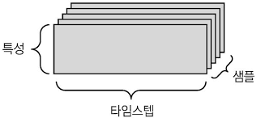
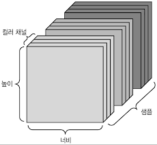
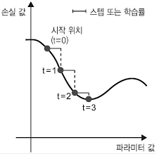
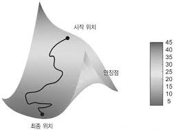

# 2장. 시작하기 전에: 신경망의 수학적 구성 요소

딥러닝을 이해하려면 여러 가지 수학 개념과 친숙해져야 한다. 텐서, 텐서 연산, 미분, 경사 하강법 등이다. 텐서와 경사 하강법을 설명하기 위해 실제 신경망 예제로 이 장을 시작하겠다. 그리고 새로운 개념을 하나씩 소개한다.


### 2.1 신경망과의 첫 만남

케라스 파이썬 라이브러리를 사용하여 손글씨 숫자 분류를 학습하는 구체적인 신경망 예제를 살펴보자. 이 문제는 흑백 손글씨 숫자 이미지(28x28 픽셀)를 10개의 범주(0에서 9까지)로 분류하는 것이다. 머신 러닝 커뮤니티에서 고전으로 취급받는 데이터셋인 MNIST를 사용하자. 이 데이터셋은 6만 개의 훈련 이미지와 1만 개의 테스트 이미지로 구성되어 있다. MNIST 문제를 알고리즘이 제대로 작동하는지 확인하기 위해 딥러닝계의 'hello world'라고 생각해도 된다.


MNIST 데이터셋은 넘파이 배열 형태로 케라스에 이미 포함되어 있다.

- 케라스에서 MNIST 데이터셋 적재하기

```python

from keras.datasets import mnist
(train_images, train_labels), (test_images, test_labels) = mnist.load_data()
```

train_image와 train_labels가 모델이 학습해야 할 **훈련 세트**를 구성한다. 모델은 test_images와 test_labels로 구성된 **테스트 세트**에서 테스트될 것이다. 이미지는 넘파이 배열로 인코딩되어 있고 레이블은 0부터 9까지의 숫자 배열이다.

- 훈련 데이터의 정보

```python
>>> train_images.shape
(60000, 28, 28)
>>> len(train_labels)
60000
>>> train_labels
array([5, 0, 4, ..., 5, 6, 8], dtype=uint8)
```

- 테스트 데이터의 정보

```python
>>> test_images.shape
(10000, 28, 28)
>>> len(test_labels)
10000
>>> test_labels
array([7, 2, 1, ..., 4, 5, 6], dtype=uint8)
```


작업 순서는 먼저 훈련 데이터를 네트워크에 주입한다. 그러면 네트워크는 이미지와 레이블을 연관시킬 수 있도록 학습된다. 마지막으로 test_images에 대한 예측을 네트워크에 요청한다. 그리고 이 예측이 test_labels와 맞는지 확인할 것이다.

- 신경망 만들기

```python
from keras import models
from keras import layers

network = models.Sequential()
network.add(layers.Dense(512, activation='relu', input_shape=(28*28,)))
network.add(layers.Dense(10, activation='softmax'))
```

신경망의 핵심 구성 요소는 일종의 데이터 처리 필터라고 생각할 수 있는 **층(layer)**이다. 어떤 데이터가 들어가면 더 유용한 형태로 출력된다. 조금 더 구체적으로 층은 주어진 문제에 더 의미 있는 **표현(representation)**을 입력된 데이터로부터 추출한다. 대부분의 딥러닝은 간단한 층을 연결하여 구성되어 있고, 점진적으로 데이터를 정제하는 형태를 띠고 있다. 딥러닝 모델은 데이터 정체 필터가 연속되어 있는 데이터 프로세싱을 위한 여과기와 같다.

이 예에서는 조밀하게 연결된 신경망 층인 Dense 층 2개가 연속되어 있다. 두 번째 층은 10개의 확률 점수가 들어 있는 배열을 반환하는 **소프트맥스(softmax)**층이다. 각 점수는 현재 숫자 이미지가 10개의 숫자 클래스 중 하나에 속할 확률이다.


신경망이 훈련 준비를 마치기 위해서 컴파일 단계에 포함될 세 가지가 더 필요하다.

1. **손실함수(Loss function)**: 훈련 데이터에서 신경망의 성능을 측정하는 방법으로 네트워크가 옳은 방향으로 학습될 수 있도록 도와주는 함수

2. **옵티마이저(Optimizer)**: 입력된 데이터와 손실함수를 기반으로 네트워크를 업데이트하는 메커니즘

3. **훈련과 테스트 과정을 모니터링할 지표**: 정확도와 다른 요소


- 컴파일 단계

```python
network.compile(optimizer='rmsprop', loss='categorical_crossentropy', 
                metrics=['accuracy'])
```


훈련을 시작하기 전에 데이터를 네트워크에 맞는 크기로 바꾸고 모든 값을 0과 1사이로 스케일을 조정한다. 훈련 이미지는 [0, 255] 사이의 값인 unit8 타입의 (60000, 28, 28) 크기를 가진 배열로 저장되어 있다. 이 데이터를 0과 1사이의 값을 가지는 float32 타입의 (60000, 28*28 ) 크기인 배열로 바꾼다.

- 이미지 데이터 준비하기

```python
train_images= train_images.reshape((60000,28*28))
train_images= train_images.astypee('float32')/255

test_images= test_images.reshape((10000,28*28))
test_images= test_images.astypee('float32')/255
```


- 레이블 준비하기

```python
from keras.utils import to_categorical

train_labels= to_categorical(train_labels)
test_labes= to_categorical(test_labels)
```


- fit 메서드를 호출하여 훈련 데이터에 모델을 학습

```python
network.fit(train_images, train_labels, epochs=5, batch_size=128)
```

훈련하는 동안 2개의 정보가 출력된다. 훈련데이터에 대한 네트워크의 손실과 정확도이다.


- 테스트 세트에서 모델이 작동하는지 확인

```python
>>> test_loss, test_acc = network.evaluate(test_images, test_labels)
>>> print('test_acc:', test_acc)
test_acc: ####
```


계산을 하면 테스트 세트의 정확도는 훈련 세트 정확도보다는 약간 낮다. 훈련 정확도와 테스트 정확도 사이의 차이는 **과대적합(overfitting)**때문이다. 이는 머신 러닝 모델이 훈련 데이터보다 새로운 데이터에서 성능이 낮아지는 경향을 말한다.


### 2.2 신경망을 위한 데이터 표현

**텐서(tensor)**라 부르는 다차원 넘파이 배열에 데이터를 저장하는 것부터 시작했다. 최근의 모든 머신 러닝 시스템은 일반적으로 텐서를 기본 데이터 구조로 사용한다. 텐서는 머신 러닝의 기본 구성 요소이다. 그럼 텐서는 무엇일까?

핵심적으로 텐서는 데이터를 위한 컨테이너이다. 거의 항상 수치형 데이터를 다루므로 숫자를 위한 컨테이너이다. 2D 텐서인 행렬에 대해 이미 알고 있을 것이다. 텐서는 임의의 차원 개수를 가지는 행렬의 일반화된 모습이다(텐서에서는 **차원(dimension)**을 종종 **축(axis)**이라고 한다).


#### 2.2.1 스칼라(0D 텐서)

하나의 숫자만 담고 있는 텐서를 **스칼라(scalar)**(또는 0차원 텐서, 0D 텐서)라고 부른다. 넘파이에서는 float32나 float64 타입의 숫자가 스칼라 텐서이다. **ndim** 속성을 사용하면 넘파이 **배열의 축 개수**를 확인할 수 있다. 스칼라 텐서의 축 개수는 0이다. 텐서의 축 개수를 **랭크(rank)**라고 한다. 

```python
import numpy as np
x= np.array(12)
>>> x.ndim
0
```


#### 2.2.2 벡터(1D 텐서)

숫자의 배열을 **벡터(vector)** 또는 1D 텐서라고 한다. 1D 텐서는 딱 하나의 축을 가진다. 

```python
>>> x=np.array([1,2,3,4,5])
>>> x
array([1,2,3,4,5])
>>> x.ndim
1
```

이 벡터는 5개의 원소를 가지고 있으므로 5차원 벡터라고 부른다. <u>5D 벡터</u>와 <u>5D 텐서</u>를 혼동하면 안된다. 5D 벡터는 하나의 축을 따라 5개의 차원을 가진 것이고 5D 텐서는 5개의 축을 가진 것이다. **차원수**는 특정 축을 따라 놓인 원소의 개수이거나 텐서의 축 개수를 의미하므로 혼동하기 쉽다. 후자의 경우 랭크 5인 텐서라고 말하는 것이 기술적으로 더 정확하다.


#### 2.2.3 행렬(2D 텐서)

벡터의 배열이 **행렬(matrix)** 또는 2D 텐서이다. 행렬에는 2개의 축이 있다(보통 **행(row)**과 **열(column**)이라고 한다). 행렬은 숫자가 채워진 사각 격자라고 생각할 수 있다. 넘파이에서 행렬을 나타내면 다음과 같다.

```python
>>> x=np.array([ [1,2,3,4],
                 [5,6,7,8],
                 [9,0,1,2] ])
>>> x.ndim
2
```

첫 번째 축에 놓여 있는 원소를 **행**이라 하고, 두 번째 축에 놓여 있는 원소를 **열**이라고 한다. 앞의 예에서는 x의 첫 번째 행은 [1,2,3,4]이고, 첫 번째 열은 [1,5,9]이다.


#### 2.2.4 3D 텐서와 고차원 텐서

이런 행렬들은 하나의 새로운 배열로 합치면 숫자가 채워진 직융면체 형태로 해석할 수 있는 3D 텐서가 만들어진다. 넘파이에서 3D 텐서를 나타내면 다음과 같다.

```python
>>> x = np.array([ [[1,2,3,4,5],
                    [6,7,8,9,0],
                    [1,2,3,4,5]], 
                   [[11,12,13,14,15],
                    [16,17,18,19,20],
                    [21,22,23,24,25]],
                   [[51,52,53,54,55],
                    [56,57,58,59,60],
                    [61,62,63,64,65]]])
>>> x.ndim
3
```

3D 텐서들을 하나의 배열로 합치면 4D 텐서를 만들 수 있다. 딥러닝에서는 보통 0D에서 4D까지의 텐서를 다룬다. 동영상 데이터를 다룰 경우에는 5D 텐서를 사용한다.


#### 2.2.5 핵심 속성

텐서는 **3개의 핵심 속성**으로 정의된다.

1. **축의 개수(랭크)**: 3D 텐서에는 3개의 축이 있고, 행렬에는 2개의 축이 있다. 넘파이 라이브러리에서는 **ndim**속성에 저장되어 있다.
2. **크기**: 텐서의 각 축을 따라 얼마나 많은 차원이 있는지를 나타낸 파이썬의 튜플이다. 예를 들어 앞에 나온 행렬의 크기는 (3, 5)이고 3D 텐서의 크기는 (3, 3, 5)이다. 벡터의 크기는 (5, )처럼 1개의 원소로 이루어진 튜플이다.
3. **데이터 타입**: 텐서에 포함된 데이터의 타입이다. 예를 들어 텐서의 타입은 float32, uint8, float64 등이 될 수 있다. 드물게 char 타입을 사용한다. 텐서는 사전에 할당되어 연속된 메모리에 저장되어야 하므로 넘파이 배열은 가변 길이의 문자열을 지원하지 않는다.


MNIST 데이터셋을 다시 살펴보자.

1. 축의 개수는 ndim 속성으로 축의 개수를 확인한다.

   print(train_images.ndim)

2. 배열의 크기는 shape으로 확인한다.
   print(train_images.shape)

3. 데이터 타입은 dtype으로 확인한다.

   print(train_images.dtype)

이 배열은 8비트 정수형 3D 텐서이다. 정확하게는 28x28 크기의 정수 행렬 6만개가 있는 배열이다. 각 행렬은 하나의 흑백 이미지고, 행렬의 각 원소는 0에서 255 사이의 값을 가진다.


#### 2.2.6 넘파이로 텐서 조작하기

train_image[i] 같은 형식으로 첫 번째 축을 따라 특정 숫자를 선택할 수 있다. 배열에 있는 특정 원소를 선택하는 것을 **슬라이싱(slicing)**이라 한다. 

11번째에서 101번째까지(101번째는 포함하지 않고) 숫자를 선택하여 (90, 28, 28) 크기의 배열을 만든다.

```python
>>> slice = train_images[10:100]
>>> print(slice.shape)
(90, 28, 28)
```


동일하지만 조금 더 자세한 표기법은 각 배열의 축을 따라 슬라이싱의 시작 인덱스와 마지막 인덱스를 지정하는 것이다.

```python
>>> slice2 = train_images[10:100, :, :]
>>> slice2.shape
(90, 28, 28)
>>> slice3 = train_images[10:100, 0:28, 0:28]
>>> slice3.shape
(90, 28, 28)
```


각 배열의 축을 따라 어떤 인덱스 사이도 선택할 수도 있다.

```python
# 이미지의 오른쪽 아래 14x14 픽셀을 선택
>>> slice4 = train_images[:, 14:, 14:]
# 음수 인덱스를 사용하여 정중앙에 위치한 14x14 픽셀 조각을 이미지에서 잘라내는 방법
>>> slice5 = train_images[:, 7:-7, 7:-7]
```


#### 2.2.7 배치 데이터

일반적으로 딥러닝에서 사용하는 모든 데이터 텐서의 첫 번째 축(인덱스가 0부터 시작하므로 0번째 축)은 **샘플 축(sample axis)**이다(이따금 샘플 차원(sample dimension)이라 한다). MNIST 예제에서는 숫자 이미지가 샘플이다.

딥러닝 모델은 한 번에 전체 데이터셋을 처리하지 않는다. 그 대신 데이터를 작은 **배치(batch)**로 나눈다. 구체적으로 말하면 MNIST 숫자 데이터에서 크기가 128인 배치 하나는 다음과 같다.

n번째 대치는 다음과 같다.

```python
batch = train_images[128*n:128*(n+1), :, :]
```

이런 배치 데이터를 다룰 때는 첫 번째 축을 **배치 축(batch axis)** 또는 **배치 차원(batch dimension)**이라고 한다.


#### 2.2.8 텐서의 실제 사례

- **벡터 데이터**: (samples, features) 크기의 2D 텐서
- **시계열 데이터** 또는 **시퀀스 데이터**: (samples, timesteps, features) 크기의 3D 텐서
- **이미지**: (samples, height, width, channels) 크기의 4D 텐서
- **동영상**: (samples, frames, height, width, channels) 크기의 5D 텐서


#### 2.2.9 벡터 데이터

많은 데이터의 경우 벡터이다. 벡터에서 첫 번째 축은 **샘플 축**이고, 두 번째 축은 **특성 축(feature axis)**이다. 2개의 예를 살펴보자.

1. 사람의 나이, 우편 번호, 소득으로 구성된 인구 통계 데이터, 각 사람은 3개의 값을 가진 벡터로 구성되고 10만 명이 포함된 전체 데이터셋은 (100000, 3) 크기의 2D 텐서(벡터)에 저장될 수 있다.
2. 각 단어가 등장한 횟수로 표현된 텍스트 문서 데이터 셋. 각 문서는 2만개의 원소를 가진 벡터로 인코딩될 수 있다. 500개의 문서로 이루어진 전체 데이터셋은 (500, 20000) 크기의 텐서로 저장된다.


#### 2.2.10 시계열 데이터 또는 시퀀스 데이터

데이터에서 시간이 중요할 때는 시간 축을 포함하여 3D 텐서로 저장된다. 각 샘플은 벡터의 시퀀스로 인코딩되므로 배치 데이터는 3D 텐서로 인코딩될 것이다. 관례적으로 시간 축은 항항 두 번째 축(인덱스가 1인 축)이다. 몇 가지 예를 들어 보면 다음과 같다.



1. **주식 가격 데이터셋**: 1분마다 현재 주식 가격, 지난 1분 동안에 최고 가격과 최소 가격을 저장한다. 1분마다 데이터는 3D 벡터로 인코딩되고 하루 동안의 거래는 (390, 3) 크기의 2D 텐서로 인코딩된다(하루의 거래 시간은 390분이다). 250일치의 데이터는 (250, 390, 3) 크기의 3D 텐서로 저장될 수 있다. 샘플 250, 타임스텝 390 특성 3이다.

2. **트윗 데이터셋**: 각 트윗은 128개의 알파벳으로 구성된 280개의 문자 시퀀스이다. 여기에서는 각 문자가 128개의 크기인 이진 벡터로 인코딩될 수 있다. 그러면 각 트윗은 (280, 128) 크기의 2D 텐서로 인코딩 될 수 있다. 100만 개의 트윗으로 구성된 데이터셋은 (1000000, 280, 128) 크기의 텐서에 저장된다. 샘플 100만개, 타임스텝 280개, 특성 128개이다.


#### 2.2.11 이미지 데이터

이미지는 전형적으로 높이, 너비, 채널의 3차원으로 이루어진다. (MNIST 숫자처럼) 흑백 이미지는 하나의 컬러 채널만을 가지고 있어 2D 텐서로 저장될 수 있지만 관례상 이미지 텐서는 항상 3D 텐서로 저장된다. 흑백 이미지의 경우 컬러 채널의 차원 크기는 1이다. 256x256 크기의 측백 이미지에 대한 128개의 배치는 (128, 256, 256, 1) 크기의 텐서에 저장될 수 있다. 컬러 이미지에 대한 128개의 배치라면 (128, 256, 256, 1) 크기의 텐서에 저장될 수 있다.



이미지 텐서의 크기를 지정하는 방식은 두 가지이다. 텐서플로에서 **채널 마지막**방식을 사용한다. 텐서플로 머신 러닝 프레임워크는 (samples, height, width, color_depth)처럼 컬러 채널의 깊이를 끝에 놓는다.


#### 2.2.12 비디오 데이터

비디오 데이터는 현실에서 5D 텐서가 필요한 몇 안되는 데이터 중 하나이다. 하나의 비디오는 프레임의 연속이고 각 프레임은 하나의 컬러 이미지이다. **프레임**이 (height, width, color_depth)의 3D 텐서로 저장될 수 있기 때문에 **프레임의 연속**은  (frames, height, width, color_depth)의 4D 텐서로 저장될 수 있다. **여러 비디오의 배치**는  (samples, frames, height, width, color_depth)의 5D 텐서로 저장될 수 있다.

예를 들어 60초짜리 144x256 유튜브 비디오 클립을 초당 4프레임으로 샘플링하면 240프레임이 된다. 이런 비디오 클립을 4개 가진 배치는 (4, 240, 144, 256, 3) 크기의 텐서에 저장된다. 총 106,168,320개의 값이 있다. 이 텐서의 dtype을 float32로 했다면 각 값이 32비트로 저장될 것이므로 텐서의 저장 크기는 405MB가 된다.


### 2.3 신경망의 톱니바퀴: 텐서 연산

심층 신경망이 학습한 모든 변환을 수치 데이터 텐서에 적용하는 몇 종류의 **텐서 연산(tensor operation)**으로 나타낼 수 있다. 예를 들어 텐서 덧셈이나 곱셈 등이 있다.

첫 번째 예제에서 Dense층을 쌓아 신경망을 만들었다. 케라스의 층은 다음과 같이 생성한다.

```python
keras.layers.Dense(512, activation='relu')
```

이 층은 2D 텐서를 입력으로 받고 입력 텐서의 새로운 표현인 또 다른 2D 텐서를 반환하는 함수처럼 생각할 수 있다. 구체적으로 보면 이 함수는 다음과 같다.


output = relu(dot(W, input)+ b)

output에는 총 3개의 텐서 연산이 존재한다. 입력 텐서 input과 가중치 텐서 W 사이의 점곱과 점곱 결과와 b와의 텐서 덧셈, 마지막으로 그 결과의 relu 연산이다.


#### 2.3.1 원소별 연산

relu 함수 덧셈은 **원소별 연산(element-wise operation)**이다. 이 연산은 텐서에 있는 각 원소에 독립적으로 적용된다. 이는 병렬 구현이 가능한 연산이라는 의미이다. 파이썬으로 단순한 원소별 연산은 for문을 이용하여 할 수 있다. 하지만 넘파이는 배열을 다룰 때 최적화된 내장 함수로 이런 연산들을 할 수 있다. 넘파이 시스템에 설치된 BLAS(Basic Linear Algebra Subprogram) 구현에 복잡한 일들을 위임한다. BLAS는 고도로 병렬화되고 효율적인 저수준의 텐서 조작 루틴이며, 전형적으로 포트란이나 C 언어로 구현되어 있어 엄청난 속도로 처리한다.


#### 2.3.2 브로드캐스팅

크기가 다른 두 텐서가 더해질 때 무슨 일이 일어날까?

모호하지 않고 실행 가능하다면 작은 텐서가 큰 텐서의 크기에 맞추어 **브로드캐스팅(broadcasting)**된다. 브로드캐스팅은 두 단계로 이루어진다.

1. 큰 텐서의 ndim에 맞도록 작은 텐서에 (브로드캐스팅 축이라고 부르는) 축이 추가된다.
2. 작은 텐서가 새 축을 따라 큰 텐서의 크기에 맞도록 반복된다.


구체적인 예를 살펴보자.

X의 크기는 (32, 10)이고 y의 크기는 (10,)라고 가정하자. 먼저 y에 비어 있는 첫 번째 축을 추가하여 크기를 (1, 10)으로 만든다. 그런 다음 y를 이 축에 32번 박복하면 텐서 Y의 크기는 (32, 10)이 된다. 여기에서 Y[i, :] == y i in range(0,32)이다. 이제 X와 Y의 크기가 같으므로 더할 수 있다.

구현 입장에서는 새로운 텐서가 만들어지면 매우 비효율적이므로 어떤 2D 텐서도 만들어지지 않는다. 반복된 연산은 완전히 가상적이다. 이 과정은 메모리 수준이 아니라 알고리즘 수준에서 일어난다. 하지만 새로운 축을 따라 벡터가 32번 반복된다고 생각하는 것이 이해하기 쉽다.

(a, b, ... n, n+1, ... m) 크기의 텐서와 (n, n+1, ... , m) 크기의 텐서 사이에 브로드캐스팅으로 원소별 연산을 적용할 수 있다. 이 때 브로드 캐스팅은 a 부터 n-1 까지의 축에 자동으로 일어난다.

```python
import numpy as np

x=np.random.random((64, 3, 32, 10))
y=np.random.random((32, 10))
z=np.maximum(x, y) # 출력 z 크기는 x와 동일하게 (64, 3, 32, 10)
```

다른 예를 들면,

```python
>>> a = np.array([ [1,2],
                   [3,4]])
>>> b = np.array([ 5,10 ])
>>> a*b
array([ [5, 20],
        [15, 40] ])
```

배열 b가 a의 형상으로 변형된 후 원소별 연산이 이루어졌다.


#### 2.3.3 텐서 점곱

**텐서 곱셈(tensor product)**이라고 부르는 텐서 점곱 연산이다. 원소별 연산과 반대로 입력 텐서의 원소들을 결합시킨다. 

점곱은 임의의 축 개수를 가진 텐서에 일반화된다. 가장 일반적인 용도는 두 행렬 간의 점곱이다. x.shape[1] == y.shape[0]일 때 두 행렬 x와 y의 점곱이 성립된다. x의 열과 y의 행 사이 점곱으로 인해 (x.shape[0], y.shape[1]) 크기의 행렬이 된다. 정리하면, 점곱이 실행되려면 x의 열과 y의 행의 개수가 일치해야 하고 그 결과는 x의 행과 y의 열을 크기로 가진다.

고차원 텐서 간의 점곱을 다음과 같이 표현할 수 있다.

(a, b, c, d) $\cdot$ (d,) $\rightarrow$ (a, b, c)

(a, b, c, d) $\cdot$ (d, e) $\rightarrow$ (a, b, c, e)


#### 2.3.4 텐서 크기 변환

꼭 알아 두어야 할 세 번째 텐서 연산은 **텐서 크기 변환(tensor reshaping)**이다. 첫 번째 신경망 예제의 Dense 층에서는 사용되지 않지만 신경망에 주입할 숫자 데이터를 전처리할 때 사용했다.

```python
train_images = train_images.reshape((60000, 28*28))
```

텐서의 크기를 변환한다는 것은 특정 크기에 맞게 열과 행을 재배열한다는 뜻이다. 당연히 크기가 변환된 텐서는 원래 텐서와 원소 개수가 동일하다.

```python
>>> x = np.array([ [0.0, 1.0],
                   [2.0, 3.0],
                   [4.0, 5.0]])
>>> print(x.shape)
(3,2)
>>> x = x.reshape((6,1))
>>> x
array([[0.],
       [1.],
       [2.],
       [3.],
       [4.],
       [5.]])
>>> x = x.reshape(2,3)
>>> x
array([[0., 1., 2.],
       [3., 4., 5.]])
```

자주 사용하는 특별한 크기 변환은 **전치(transpose)**이다. 행렬의 전치는 행과 열을 바꾸는 것을 의미한다.


#### 2.3.5 텐서 연산의 기하학적 해석

아핀 변환, 회전, 스케일링 등처럼 기본적인 기하학적 연산은 텐서 연산으로 표현될 수 있다. 


#### 2.3.6 딥러닝의 기하학적 해석

신경망은 전체적으로 텐서 연산의 연결로 구성된 것이고, 모든 텐서 연산은 입력 데이터의 기하학적 변환이다. 단순한 단계들이 길게 이어져 구현된 신경망을 고차원 공간에서 매우 복잡한 기하학적 변환을 하는 것으로 해석할 수 있다. 복잡하고 심하게 꼬여 있는 데이터의 매니폴드에 대한 깔끔한 표현을 찾는 일이다. 


### 2.4 신경망의 엔진: 그래디언트 기반 최적화

이전 절에서 첫 번째 신경망 예제에 있는 각 층은 입력 데이터를 다음과 같이 변환한다.

output = relu(dot(W, input) + b)

이 식에서 텐서 W와 b는 층의 속성으로 볼 수 있다. **가중치** 또는 **훈련되는 파라미터**라고 부른다(각각 커널과 편향이라고 부른다). 이런 가중치에는 훈련 데이터를 신경망에 노출시켜서 학습된 정보가 담겨 있다. 

초기에는 가중치 행렬이 작은 난수로 채운다(**무작위 초기화** 단계라고 부른다). 물론 W와 b가 난수일 때 relu(dot(W, input) + b)가 어떤 유용한 표현을 만들지는 기대할 수 없다. 하지만 이는 시작 단계일 뿐이다. 그다음에는 피드백 신호에 기초하여 가중치가 점진적으로 조정될 것이다. 이런 점진적 조정 또는 **훈련**이 머신 러닝 학습의 핵심이다.

훈련은 다음과 같은 **훈련 반복 루프**안에서 일어난다.

1. 훈련 샘플 x와 타겟 y의 배치를 추출한다.
2. x를 사용하여 네트워크(모델)를 실행하고, 예측 y_predict를 구한다.
3. y_predict와 y의 차이를 측정하여 이 배치에 대한 네트워크(모델)의 손실을 계산한다.
4. 배치에 대한 손실이 조금 감소되도록 네트워크(모델)의 모든 가중치를 업데이트한다.

결국 훈련 데이터에서 네트워크의 손실, 예측 y_predict와 타겟 y의 오차가 작아지는 방향으로 향할 것이다. 이 네트워크(모델)는 입력에 정확한 타겟을 매핑하는 것을 학습했다. 

이런 문제를 풀기 위해 접근할 수 있는 한가지 방법은 모든 가중치 행렬의 원소마다 두 번의 정방향 패스를 계산할 수 있는데 이는 엄청나게 비효율적이다. 따라서 신경망에 사용된 모든 연산이 **미분 가능**하다는 장점을 사용하여 네트워크 가중치에 대한 손실의 **그래디언트**를 계산하는 것이 훨씬 더 좋은 방법이다.


#### 2.4.1 변화율이란?

연속적이고 매끄러운 함수 $y=f(x)$를 생각해보자. 이 함수가 연속적이므로 x가 변하면 y도 역시 변하게 될 것이다. x라는 점에서 x값은 약간 변화 시켰을 때, 변화율을 수식적으로 표현하면 $f(x+\Delta{x})-f(x)=\Delta{y}$이다. 

평균 변화율을 구하면 다음과 같다. 
$$
\frac{f(x+\Delta{x})-f(x)}{\Delta{x}}=\frac{\Delta{y}}{\Delta{x}}
$$


만약 $\Delta{x}$가 아주 작다면 x라는 점에서 순간 변화율을 구할 수 있다. 그에 대한 표현은 다음과 같다.
$$
\frac{dx}{dy}=\lim_{\Delta{x} \to 0} \frac{f(x+\Delta{x})-f(x)}{\Delta{x}}
$$


#### 2.4.2 텐서 연산의 변화율: 그래디언트

**그래디언트**는 텐서 연산의 변화율이다. 이는 다차원 입력, 즉 텐서를 입력으로 받은 함수에 대한 변화율 개념을 확장시킨 것이다. 

함수 $f(x)$에 대해서는 변화율의 반대 방향으로 x를 조금 움직이면 $f(x)$의 값을 감소시킬 수 있다. 동일한 방식을 적용하면 $f(W)$의 입장에서는 그래디언트의 반대 방향으로 W를 움직이면 $f(W)$의 값을 줄일 수 있다. 예를 들어 $W_{1} = W_{0} - step*\nabla{f(W_0)}$이다. step은 스케일을 조정하기 위한 작은 값이다. 이 말은 기울기가 작아지는 곡면의 낮은 위치로 이동된다는 의미이다. $\nabla{f(W_0)}$는 $W_{0}$에 아주 가까이 있을 때 기울기를 근사한 것이다.


#### 2.4.3 확률적 경사 하강법

미분 가능한 함수가 주어지면 이론적으로 이 함수의 최솟값을 해석적으로 구할 수 있다. 함수의 최솟값은 변화율이 0인 지점이다. 변화율이 0이 되는 지점을 모두 찾고 이 중에서 어떤 포인트의 함수 값이 가장 작은지 확인하는 것이다.

신경망에 적용하면 가장 작은 손실 함수의 값을 만드는 가중치의 조합을 해석적으로 찾는 것을 의미한다. 식 $\nabla{f(W)}=0$을 풀면 해결된다. 이 식은 N개의 변수로 이루어진 다항식이다. 여기서 N은 네트워크의 **가중치 개수**이다. N=2 나 N=3인 식을 푸는 것은 가능하지만 실제 신경망에서는 파라미터의 개수가 수천만 개가 되기 때문에 해석적으로 해결하는 것이 어렵다.

그 대신 앞서 2.4절에서 설명한 알고리즘 네 단계를 사용할 수 있다. 랜덤한 배치 데이터에서 현재 손실 값을 토대로 하여 조금씩 파라미터를 수정하는 것이다. 미분 가능한 함수를 가지고 있으므로 그래디언트를 계산하여 단계 4를 효율적으로 구현할 수 있다. 그래디언트의 반대 반향으로 가중치를 업데이트하면 손실이 매번 조금씩 감소할 것이다.

1. 훈련 샘플 x와 타겟 y의 배치를 추출한다.
2. x를 사용하여 네트워크(모델)를 실행하고, 예측 y_predict를 구한다.
3. y_predict와 y의 차이를 측정하여 이 배치에 대한 네트워크(모델)의 손실을 계산한다.
4. 네트워크의 파라미터에 대한 손실 함수의 그래디언트를 계산한다(**역방향 패스(backward pass)**).
5. 그래디언트의 반대 방향으로 파라미터를 조금 이동시킨다.

이 과정이 **미니 배치 확률적 경사 하강법(mini-batch stochastic gradient descent)**(미니 배치 SGD)이다. **확률적(stochastic)**이란 단어는 각 배치 데이터가 무작위로 선택된다는 의미이다. 네트워크의 파라미터와 훈련 샘플이 하나일 때 이 과정은 다음과 같다.



그림에서 보듯이 간격(step)을 적절히 고르는 것이 중요하다. 너무 작으면 곡선을 따라 내려가는 데 너무 많은 반복이 필요하고 지역 최솟값에 갇힐 수 있다. 간격이 너무 너무 크면 손실 함수 곡선에서 완전히 임의의 위치로 이동시킬 수 있다.

**미니 배치 SGD** 알고리즘의 한 가지 변종은 반복마다 하나의 샘플과 하나의 타깃을 뽑는 것이다. 이것은 진정한 **SGD**이다. 다른 한편으로 극단적인 반대의 경우를 생각해 보면 가용한 모든 데이터를 사용하여 반복을 실행할 수 있다. 이를 **배치 SGD(batch SGD)**라고 한다. 더 정확하게 업데이트되지만 더 많은 비용이 든다. 극단적인 두 가지 방법의 효율적인 절충안은 적절한 크기의 미니 배치를 사용하는 것이다.


2D 손실 함수의 표면을 따라 진행하는 경사 하강법을 시각화해 볼 수 있다. 



하지만 신경망에서는 가중치가 수백, 수천만개가 되므로 훈련되는 실제 과정을 시각화하기 어렵다.

또 업데이트할 다음 가중치를 계산할 때 현재 그래디언트 값만 보지 않고 이전에 업데이트된 가중치를 여러 가지 다른 방식으로 고려하는 SGD 변종이 많이 있다. 예를 들어 모멘텀을 사용한 SGD, Adagrad, RMSProp 등이 있다. 이런 변종들을 모두 **최적화 방법(optimization method)**라고 부른다. 특히 여러 변종들 중에서 사용하는 **모멘텀**개념은 중요하다. 모멘텀은 SGD에 있는 2개의 문제점인 수렴속도와 지역 최솟값을 해결한다. 모멘텀을 사용한 최적화를 살펴보면 손실 곡선 위로 작은 공을 굴리는 것으로 생각하면 쉽게 이해할 수 있다. 모멘텀이 충분하면 공이 골짜기에 갇히지 않고 전역 최솟값에 도달할 수 있다. 모멘텀은 현재 기울기 값뿐만 아니라 (과거의 가속도로 인한) 현재 속도를 함께 고려하여 각 단계에서 공을 움직인다.


#### 2.4.4 변화율 연결: 역전파 알고리즘

앞의 알고리즘에서 함수가 미분 가능하기 때문에 변화율을 직접 계산할 수 있다고 잠시 가정했다. 실제로 신경망은 많은 텐서 연산으로 구성되어 있고 이 연산들의 변화율은 간단하며 이미 잘 알려져 있다.

연쇄 법칙을 신경망의 그래디언트 계산에 적용하여 **역전파(backpropagation)** 알고리즘(**후진 모드 자동 미분(reverse-mode automatic differentiation**)이 탄생되었다. 역전파는 최종 손실 값에서부터 싲작한다. 손실 값에 각 파라미터가 기여한 정도를 계산하기 위해 연쇄 법칙을 적용하여 최상위 층에서 하위층까지 거꾸로 진행된다.

요즘에는 그리고 향후 몇 년 동안은 텐서플로처럼 **기호 미분(symbolic differentiation)**이 가능한 최신 프레임워크를 사용하여 신경망을 구현할 것이다. 이 말은 변화율이 알려진 연산들로 연결되어 있으면 네트워크 파라미터와 그래디언트 값을 매핑하는 그래디언트 함수를 계산할 수 있다는 의미이다. 이런 함수를 사용하면 역방향 패스는 그래디언트 함수를 호출하는 것으로 단순화될 수 있다.


