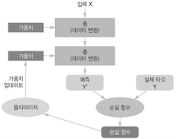

# 3장. 신경망 시작하기

이 장에서는 신경망을 사용하여 실제 문제를 풀어보자. 2장의 첫 번째 예제에서 얻은 지식을 정리하고, 신경망에서 가장 많이 사용되는 세 종류의 문제인 <u>이진 분류</u>, <u>다중 분류</u>, <u>회귀</u>에 배운 것들을 적용해 보자.

또 2장에서 소개했던 **층**, **네트워크(모델)**, **목적 함수(손실 함수)**, **옵티마이저**와 같은 신경망의 핵심 구성 요소들을 자세히 살펴보자. 그리고 파이썬 딥러닝 라이브러리인 **케라스**도 간략히 소개하며, 텐서플로, GPU를 사용한 딥러닝을 실행하기 위해 컴퓨터를 세팅해보자. 실전 문제를 해결하는 데 신경망을 어떻게 사용하는지 세 가지 기본 예제로 자세히 살펴보자.

- **이진 분류**: 영화 리뷰를 긍정 또는 부정으로 분류하기
- **다중 분류**: 신문 기사를 토픽으로 분류하기
- **회귀**: 부동산 데이터를 바탕으로 주택 가격을 예측하기

신경망으로 벡터 데이터를 사용한 분류나 회귀 같은 간단한 머신 러닝 문제를 해결할 수 있고, 그 다음 장에서는 머신 러닝의 원리와 이론을 더 깊게 이해할 수 있을 것이다.


### 3.1 신경망의 구조

신경망 훈련에는 다음 요소들이 관련되어 있다.

1. **네트워크(또는 모델)**를 구성하는 **층**
2. **입력 데이터**와 그에 대응하는 **타겟**
3. 학습에 사용할 피드백 신호를 정의하는 **손실 함수**
4. 학습 진행 방식을 결정하는 **옵티마이저**



연속된 층으로 구성된 **네트워크(모델)**가 입력 데이터를 예측으로 매핑한다. **손실 함수**는 예측과 타겟을 비교하여 네트워크의 예측이 기댓값에 얼마나 잘 맞는지를 측정하는 손실 값을 만든다. **옵티마이저**는 손실 값을 사용하여 네트워크 가중치를 업데이트 한다.


#### 3.1.1 층: 딥러닝의 구성 단위

신경망의 핵심적인 데이터 구조는 소개한 **층**이다. 층은 하나 이상의 텐서를 입력으로 받아 하나 이상의 텐서를 출력하는 데이터 처리 모듈이다. 어떤 종류의 층은 상태가 없지만 대부분의 경우 **가중치**라는 층의 상태를 가진다. 가중치는 확률적 경사 하강법에 의해 학습되는 하나 이상의 텐서이며 여기에 네트워크가 학습한 **지식**이 담겨 있다.

층마다 적절한 텐서 포맷과 데이터 처리 방식이 다르다. 예를 들어 (samples, features) 크기의 2D 텐서가 저장된 간단한 벡터 데이터는 **완전 연결 층(fully connected layer)**이나 **밀집 층(dense layer)**이라고 불리는 **밀집 연결 층(densely connected layer)**에 의해 처리되는 경우가 많다. (samples, timesteps, features) 크기의 3D 텐서로 저장된 시퀀스 데이터는 보통 LSTM 같은 **순환 층(recurrent layer)**에 의해 처리된다. 4D 텐서로 저장되어 있는 이미지 데이터는 일반적으로 **2D 합성곱 층(convolution layer)**에 의해 처리된다.

케라스에서는 호환 가능한 층들을 엮어 데이터 변환 파이프라인을 구성함으로써 딥러닝 모델을 만든다. 여기에서 **층 호환성(layer compatibility)**은 각 층이 특정 크기의 입력 텐서만 받고 특정 크기의 출력 텐서를 반환한다는 사실을 의미한다.

```python
from keras import models
from keras import layers

model=models.Sequential()
model.add(layers.Dense(32,input_shape=(784,)))
model.add(layers.Dense(10))
```

첫 번째 차원이 784인 2D 텐서만 입력으로 받는 층을 만들었다(배치 차원인 0번째 축은 지정하지 않기 때문에 어떤 배치 크기도 입력 받을 수 있다). 이 층은 첫 번째 차원 크기가 32로 변환된 텐서를 출력할 것이다. 케라스에서는 모델에 추가된 층을 자동으로 상위 층의 크기에 맞추어 주기 때문에 호환성을 걱정하지 않아도 된다.두 번째 층에서는 input_shape 매개변수를 지정하지 않았고, 그 대신 앞선 층의 출력 크기를 입력 크기로 자동으로 채택한다.


#### 3.1.2 모델: 층의 네트워크

딥러닝 모델은 층으로 만든 비순환 유향 그래프이다. 가장 일반적인 예가 하나의 입력을 하나의 출력으로 매핑하는 층을 순서대로 쌓는 것이다.

앞으로 공부하다 보면 아주 다양한 네트워크 구조를 보게 될 것이다. 자주 등장하는 것들은 다음과 같다.

- 가지(branch)가 2개인 네트워크
- 출력이 여러 개인 네트워크
- 인셉션(inception) 블록

네트워크 구조는 **가설 공간**을 정의한다. 1장에서 머신 러닝을 '가능성 있는 공간을 사전에 정의하고 피드백 신호의 도움을 받아 입력 데이터에 대한 유용한 변환을 찾는 것'으로 정의했다. 네트워크 구조를 선택함으로써 **가능성 있는 공간**을 입력 데이터에서 출력 데이터로 매핑하는 일련의 특정 텐서 연산으로 제한하게 된다. 여기서 찾아야 할 것은 이런 텐서 연산에 포함된 가중치 텐서의 좋은 값이다.


#### 3.1.3 손실 함수와 옵티마이저: 학습 과정을 조절하는 열쇠

네트워크 구조를 정의하고 나면 두 가지를 선택해야 한다.

1. **손실 함수(loss function)(목적 함수(objective function)**: 훈련하는 동안 최소화될 값이다. 주어진 문제에 대한 성공 지표가 된다.
2. **옵티마이저(optimizer)**: 손실 함수를 기반으로 네트워크가 어떻게 업데이트될지 결정한다. 특정 종류의 확률적 경사 하강법(SGD)을 구현한다.

여러 개의 출력을 내는 신경망은 여러 개의 손실 함수를 가질 수 있다. 하지만 경사 하강법 과정은 하나의 스칼라 손실 값을 기준으로 한다. 따라서 손실이 여러 개인 네트워크에서는 모든 손실을 평균 내어 하나의 스칼라 양으로 합친다.

문제에 맞는 올바른 목적 함수를 선택하는 것은 아주 중요하다. 분류, 회귀와 시퀀스 예측 같은 일반적인 문제에서는 올바른 손실 함수를 선택하는 간단한 지침이 있다. 예를 들어 2개의 클래스가 있는 분류 문제에는 **이진 크로스엔트로피(binary crossentropy)**, 여러 개의 클래스가 있는 분류 문제에는 **범주형 크로스엔트로피(categorical crossentropy)**, 회귀 문제에는 **평균 제곱 오차(mean sqaured error)**, 시퀀스 학습 문제에는 **CTC(connection temporal classification)** 등을 사용한다. 완전히 새로운 연구를 할 때만 독자적인 목적 함수를 만들게 된다.


### 3.2 케라스 소개

이 책에서는 코드 예제를 위해 케라스를 사용한다. 케라스는 거의 모든 종류의 딥러닝 모델을 간편하게 만들고 훈련시킬 수 있는 파이썬을 위한 딥러닝 프레임워크이다. 

케라스의 특징은 다음과 같다.

- 동일한 코드로 CPU와 GPU에서 실행할 수 있다.
- 사용하기 쉬운 API를 가지고 있어 딥러닝 모델의 프로토타입을 빠르게 만들 수 있다.
- (컴퓨터 비전을 위한) 합성곱 신경망, (시퀀스 처리를 위한) 순환 신경망을 지원하며 이 둘을 자유롭게 조합하여 사용할 수 있다.
- 다중 입력이나 다중 출력 모델, 층의 고유, 모델 공유 등 어떤 네트워크 구조도 만들 수 있다. 이 말은 적대적 생성 신경망(Generative Adversarial Network, GAN)부터 뉴럴 튜링 머신(Neural Turing Machine)까지 케라스는 기본적으로 어떤 딥러닝 모델에도 적합하다는 뜻이다.


#### 3.2.1 케라스, 텐서플로, 씨아노, CNTK

케라스는 딥러닝 모델을 만들기 위한 고수준의 구성 요소를 제공하는 모델 수준의 라이브러리이다. 텐서 조작이나 미분 같은 저수준의 연산을 다루지 않는다. 그 대신 케라스의 **백엔드 엔진(backend engine)**에서 제공하는 최적화되고 특화된 텐서 라이브러리를 사용한다. 케라스는 하나의 텐서 라이브러리에 국한하여 구현되지 않고 모듈 구조로 되어 있다. 여러 가지 백엔드 엔진이 케라스와 매끄럽게 연동된다. 

텐서플로, CNTK, 씨아노는 딥러닝을 위한 주요 플랫폼 중 하나이다. 케라스로 작성한 모든 코드는 아무런 변경 없이 이런 백엔드 중 하나를 선택해서 실행시킬 수 있다. 개발하는 중간에 하나의 백엔드가 특정 잡업에 빠르다고 판단되면 언제든지 백엔드를 바꿀 수 있어 아주 유용하다.


#### 3.2.2 케라스를 사용한 개발: 빠르게 둘러보기

전형적인 케라스 작업 흐름은 다음과 같다.

1. 입력 텐서와 타켓 텐서로 이루어진 훈련 데이터를 정의한다.

2. 입력과 타겟을 매핑하는 층으로 이루어진 네트워크(또는 모델)를 정의한다.
3. 손실 함수, 옵티마이저, 모니터링하기 위한 측정 지표를 선택하여 학습 과정을 설정한다.
4. 훈련 데이터에 대해 모델의 fit() 메서드를 반복적으로 호출한다.

모델을 정의하는 방법은 두 가지인데,  Sequential 클래스(가장 자주 사용하는 구조인 층을 순서대로 쌓아 올린 네트워크이다) 또는 **함수형 API**(완전히 임의의 구조를 만들 수 있는 비순환 유향 그래프를 만든다)를 사용한다.


Sequential 클래스를 사용하여 정의한 2개의 층으로 된 모델은 다음과 같다,

```python
from keras import models
from keras import layers

model = models.Sequential()
model.add(layers.Dense(32, activation='relu', input_shape=(784,)))
model.add(layers.Dense(10, activation='softmax'))
```

함수형 API를 사용하면 다음과 같다.

```python
input_tensor = layers.Input(shape=(784,))
x = layers.Dense(32, activation='relu')(input_tensor)
output_tensor = layers.Dense(10, activation='softmax')(x)

model=modles.Model(inputs=input_tensor, outputs=output_tensor)
```

함수형 API를 사용하면 모델이 처리할 데이터 텐서를 만들고 마치 함수처럼 이 텐서에 층을 적용한다. 모델 구조가 정의된 후에는 Sequential 모델을 사용했는지 함수형 API를 사용했는지는 상관없다.


컴파일 단계에서 학습 과정이 설정된다. 여기에서 모델이 사용할 옵티마이저와 손실 함수, 훈련 하는 동안 모니터링하기 위한 측정 지표를 지정한다.

```python
from keras import optimizers
model.compile(optimizer=optimizer.RMSprop(lr=0.001),loss='mse',metrics=['accuracy'])
```


마지막으로 입력 데이터의 넘파이 배열을 모델의 fit() 메서드에 전달함으로써 학습과정이 이루어진다.

```python
model.fit(input_tensor, target_tensor, batch_size=128, epochs=10)
```


### 3.3 딥러닝 컴퓨터 셋팅

딥러닝 애플리케이션 개발을 시작하기 전에 먼저 컴퓨터를 셋팅해야 한다. 합성곱 신경망을 사용한 이미지 처리나 순환 신경망을 사용한 시퀀스 처리 같은 일부 애플리케이션을 CPU에서 실행하면 아주 빠른 멀티코어 CPU라도 매우 오래 걸린다. 실제로 CPU에서 실행할 수 있는 애플리케이션일지라도 최신 GPU를 사용하면 보통 2배나 5배 또는 10배 정도로 빨라진다. 

컴퓨터에 GPU를 설치하고 싶지 않다면 대안으로 AWS EC2 GPU 인스턴스나 구글 클라우드 플랫폼을 고려해 볼 수 있다.

로컬 컴퓨터를 셋팅하든지 또는 클라우드를 사용하는지에 상관없이 유닉스 운영체제를 사용하는 것이 좋다. 조금 번거로울 수 있지만 우분투를 사용하면 장기적으로 시간이 절약되고 문제가 발생할 가능성이 적다.


#### 3.3.1 주피터 노트북: 딥러닝 실험을 위한 최적의 방법

주피터 노트북은 딥러닝 실험을 위한 최적의 방법이다. 주피터 노트북은 데이터 과학과 머신 러닝 커뮤니티에서 폭넓게 사용된다. **노트북**은 주피터 노트북 애플리케이션으로 만든 파일이며 웹 브라우저에서 작성할 수 있다. 작업 내용을 기술하기 위해 서식 있는 텍스트 포맷을 지원하며 파이썬 코드를 실행할 수 있는 기능도 있다. 노트북에서는 긴 코드를 작게 쪼개 독립적으로  실행할 수 있어 대화식으로 개발이 가능하고, 작업 중에 무언가 잘못되었을 때 이전 코드를 모두 재실행할 필요가 없다.


#### 3.3.2 케라스 시작하기: 두 가지 방법

- 공식 EC2 딥러닝 AMI를 사용해서 EC2에서 주피터 노트북으로 케라스 예제를 실행한다. 로컬 컴퓨터에 GPU가 없을 때 이 방법을 사용한다.

- 로컬 유닉스 컴퓨터에 처음부터 모든 것을 설치한다. 그다음 로컬 컴퓨터에서 주피터 노트북을 실행하든지 아니면 일반 파이썬 스크립트를 실행한다. 이미 고사양 NVIDIA GPU카드가 있을 때 이 방법을 사용한다.

  

#### 3.3.3 클라우드에서 딥러닝 작업을 수행했을 때 장단점

딥러닝을 위해 사용할 GPU 카드가 없다면, 클라우드에서 딥러닝 실험을 하는 것이 하드웨어를 추가로 구매하지 않고 시작할 수 있는 간단하고 저렴한 방법이다. 주피터 노트북을 사용한다면 클라우드에서 실행하는 것과 로컬에서 실행하는 것에 차이가 없다. 

대규모 딥러닝 작업을 수행하는 사용자라면 이런 설정은 장기적으로 또는 여러 주 이상 진행한다고 했을 때도 적합하지 않다. EC2 인스턴스는 비싸다. 심각한 딥러닝 작업을 하려면 하나 이상의 GPU 카드를 장착한 로컬 컴퓨터를 준비해야 한다.


#### 3.3.4 어떤 GPU 카드가 딥러닝에 최적일까?

GPU를 사기로 결정했다면 어떤 것을 사야 할까? 유념해야 할 것은 NVIDIA GPU여야 한다는 점이다. NVIDIA는 딥러닝 분야에 많은 투자를 한 유일한 그래픽 컴퓨터 회사이다. 최신 딥러닝 프레임워크들은 NVIDIA 그래픽 카드에서만 작동한다.


### 3.4 영화 리뷰 문제:  이진 분류 예제

이진 분류(binary classification) 또는 이종 분류(two-class classification)는 아마도 가장 널리 적용된 머신 러닝 문제이다.


#### 3.4.1 IMDB 데이터셋

자세한 내용은 <3-4 Binary Classification(IMDB).ipynb> 파일 참고


#### 3.4.2 